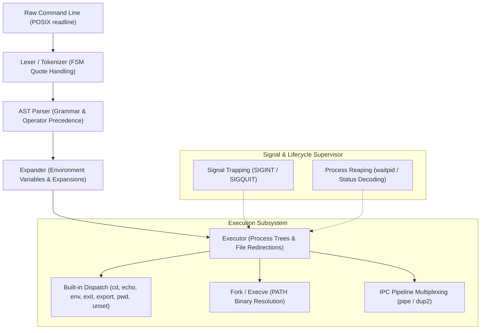

# Minishell — POSIX-Compliant Command Execution Engine

[](https://github.com/higrub89/minishell/actions/workflows/ci.yml)


A deterministic command execution runtime in C replicating core POSIX.1-2017 shell behaviors. Engineered with an Abstract Syntax Tree (AST) parser, asynchronous signal traps, multi-stage inter-process communication pipelines, and zero-leak memory invariants.

---

## Architecture & Systems Design

The engine executes an iterative read-eval-print loop (REPL) backed by a 4-tier processing pipeline:



### 1. Lexical Analysis & Token Stream
- State-machine tokenization handling single (`'`) and double (`"`) quote states.
- Exact delimiter tokenization for metacharacters: `|`, `<`, `>`, `<<`, `>>`.
- Semantic expansion of environment variables (`$VAR`, `$?`) while preserving quoted literals.

### 2. Abstract Syntax Tree (AST) Parser
- Converts linear token streams into an executable binary tree representation.
- Enforces strict operator precedence: Command sequences and pipes (`|`) partition nodes, with input/output redirections bound directly to command execution contexts.
- Immediate syntax error detection with standard POSIX exit status code `2`.

### 3. Process Lifecycle & Execution Engine
- **Process Trees**: Subprocess creation via `fork()`, executing binaries with `execve()`.
- **IPC Pipelines**: Multiplexes standard input/output streams using `pipe()` and atomic file descriptor duplication via `dup2()`.
- **Heredoc Management**: Captures multi-line delimiter inputs without polluting user terminal state.
- **Asynchronous Signal Safety**: Context-sensitive trapping for `SIGINT` (Ctrl+C) and `SIGQUIT` (Ctrl+\) during both interactive prompts and child process execution.

---

## Technical Specifications

| Component | Technical Implementation | Conformance Target |
| :--- | :--- | :--- |
| **Language & Standard** | Pure C (ISO/IEC 9899:1999) | `-Wall -Wextra -Werror` |
| **Parser Architecture** | Abstract Syntax Tree (AST) Recursive Descent | Structured Precedence |
| **Process Orchestration**| `fork`, `execve`, `waitpid`, `pipe`, `dup2` | POSIX.1-2017 Process Model |
| **Built-in Commands** | `echo`, `cd`, `pwd`, `export`, `unset`, `env`, `exit` | IEEE Std 1003.1 |
| **Memory Policy** | Deterministic allocation / zero reachable heap bytes | Valgrind Memcheck Verified |
| **Signal Handling** | Safe state transitions via `sigaction` / `signal` | Re-entrant async-safe |

---

## Build & Verification

### Compilation

```bash
# Build production executable
make

# Clean compilation object files
make clean

# Purge binaries and libraries
make fclean

# Rebuild from scratch
make re
```

### Memory & Stability Audits

Every pull request and push is continuously audited under Valgrind Memcheck with custom suppression configurations (`readline.supp`):

```bash
# Test complex pipeline execution under Valgrind
echo "ls | wc -l" | valgrind --suppressions=readline.supp --leak-check=full ./minishell

# Test redirection and file descriptor isolation
printf "echo hello > test.txt\ncat test.txt\nrm -f test.txt\n" | valgrind --suppressions=readline.supp --leak-check=full ./minishell
```

---

## Author & Engineering Standards

**Rubén D. Higuita** — Systems & Embedded Software Engineer  
Madrid, Spain • [LinkedIn](https://www.linkedin.com/in/higrub89/) • [GitHub](https://github.com/higrub89) • [Portfolio](https://higrub89.github.io)

```text
Engineering Invariant:
Zero memory leaks, deterministic process reaping, and absolute compliance with POSIX runtime standards.
```
